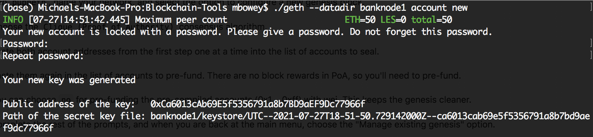
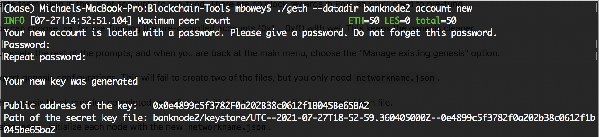
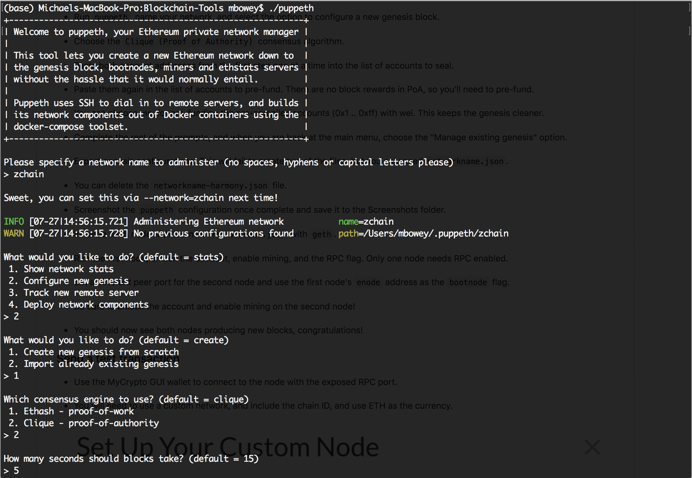
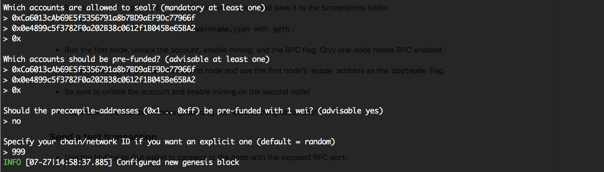
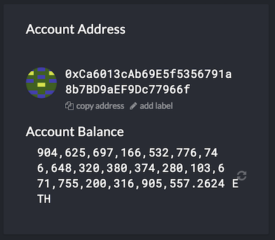
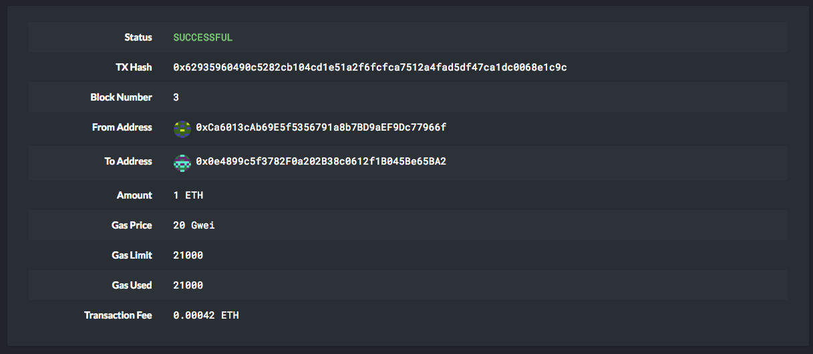

# Assignment_18_Blockchain_PoA

---

## Overview 
The objective of this assignment was to explore the functionality of blockchain technology by setting up a private testnet. The private testnet utilizes Puppeth, Geth and a Clique Proof of Authority consensus algorithim. The Proof of Authority (PoA) algorithm is typically used for private blockchain networks as it requires pre-approval of the account addresses that have the ability to approve transactions (seal blocks).  The following report will outline the various steps required to launch the test network including the network configuration.

## Blockchain Network Configuration

* Network Name: `zchain`
* Consensus: `Proof of Authority`
* Blocktime: `5 seconds`
* Chain ID: `999`
* URL: `http://127.0.0.1:8545`

* Validator Node 1: 
     * Name: `banknode1`
     * Address:  `0xCa6013cAb69E5f5356791a8b7BD9aEF9Dc77966f`
     * Port: `30303`
     * Password: `test1234`

* Validator Node 2: 
     * Name: `banknode2`
     * Address:  `0x0e4899c5f3782F0a202B38c0612f1B045Be65BA2`
     * Port: `30304`
     * Password: `test1234`


## Step 1 - Creating Nodes
The first step is to create two new nodes with new account addresses that will serve as our pre-approved block sealer addresses. We need to complete this step first, as we need to approve these addresses when setting up our genesis block. 

* Navigating to our `Blockchain-Tools` folder in terminal we use the following code for each node and enter a password:

```bash
./geth --datadir banknode1 account new
```

* Save the name of your `banknode1` public address, your password and the path of your keystore file as seen in the screenshot below:




* Repeat the process for the second node:

```bash
./geth --datadir banknode2 account new
``` 



## Step 2 - Genesis Blocks
Once you have your nodes created, the next step is setting up your genesis block. 

* Open a terminal window, navigate to the `Blockchain-Tools` folder and type the following command:

 ```bash
 ./puppeth
 ```
* Your screen should look like the following:




* Next type in `zchain` to name your network (any name would work) and hit enter to move forward in the wizard.

* Type `2` to pick the `Configure new genesis` option, then `1` to `Create new genesis from scratch`:

Now you have the option to pick a consensus algorithm to use.

* Type `2` to choose `Clique Proof of Authority` and hit enter. 

* You will also be prompted to setup your blocktime. For my blockchain, I have selected `5 seconds` to speed up the validation time. The default time is `15 seconds`. 

Next you will be prompted to setup your validation nodes.

* Copy and paste the addresses from your nodes created in step 1 into the list of accounts to seal.  

* Paste them again in the list of accounts to pre-fund. And then choose 'no' for pre-funding the pre-compiled accounts with wei. 

* Next you will need to pick a number of your choice to use as a chain ID. This will be used to help connect MyCrypto Wallet to your network. In my case, I used `999` and then hit enter. See below screenshot as a reference.



You should see a success message that your Genesis Block has been configured and you will then be taken back to the main menu. 


## Step 3 - Initialize Nodes

With the genesis block created, you will now need to initialize the nodes using the genesis' json file.

* First from the main menu in your open terminal window, choose the 'Manage existing genesis' option.

* Select Export genesis configurations, which will download your network configurations to your `Blockchain-Tools` directory.   

Using geth, initialize each node with the `zchain.json` file we just exported:

```bash
./geth --datadir banknode1 init zchain.json
```

```bash
./geth --datadir banknode2 init zchain.json
```


## Step 4 - Begin Mining Blocks
The last step to get your blockchain up and running is to start mining blocks. 

* In order to run your seperate nodes, open seperate terminal windows and again navigate to your `Blockchain-Tools` directory

* In each terminal window, type the following commands: 

banknode1:
```bash
 ./geth --datadir node1 --unlock "0xCa6013cAb69E5f5356791a8b7BD9aEF9Dc77966f" --mine --rpc --allow-insecure-unlock
 ```

* Copy the resulting enode address from the terminal that you will use to connect your second node:

banknode2:
 ```bash
 ./geth --datadir node2 --unlock "0x0e4899c5f3782F0a202B38c0612f1B045Be65BA2" --mine --port 30304 --bootnodes "enode://db7d0481cdd139ee4cd07ab9d281b2fcc0df05c7fe05fa61a032df54771ee798669f0194fe1e8e5ccee519d52e4f126d19264ae6a8809520826d660cd5c90518@127.0.0.1:30303" --ipcdisable --allow-insecure-unlock
 ```

* **NOTE:** Type the password for each node that you setup in Step 1 and hit enter - even if you can't see it visually!

* Your blockchain should now be running and creating new blocks.

## Step 5 - Connecting MyCrypto 
Now that we have our blockchain network up and running. We can now connect MyCrypto in order to check our address balances and send transactions.

* Open the MyCrypto app, then click `Change Network` at the bottom left:

* Click "Add Custom Node", then add the custom network information that you set in the genesis.

* Scroll down to choose `Custom` in the "Network" column to reveal more options like `Chain ID`:

    * Type `ETH` in the Currency box.
    
    * In the Chain ID box, type the chain id `999` we generated during genesis creation.

    * In the URL box type: `http://127.0.0.1:8545`.  This points to the default RPC port on your local machine.

    * Finally, click `Save & Use Custom Node`. 

## Step 6 - Unlock Wallets & Check Balances
Now we can send transactions between our wallets. 

* Select the `View & Send` option from the left menu pane, then click `Keystore file`.

* On the next screen, click `Select Wallet File`, then navigate to the keystore directory inside your `banknode1` directory, select the file located there, provide your password when prompted and then click `Unlock`.

    * This will open your account wallet inside MyCrypto where you can check your balance. 


    
* You can repeat the process for `banknode2`.
    
## Step 7 - Send Transactions
To send a transaction, enter the address you would like to send 'ETH' to in the `To Address` box. You can use the public address of your second node and then fill in an arbitrary amount of ETH and click `Send Transaction`.

* Confirm the transaction by clicking "Send Transaction", and the "Send" button in the pop-up window.  

* Click the `Check TX Status` when the green message pops up, confirm the logout:

* You should see the transaction go from `Pending` to `Successful` in around the same blocktime (`5seconds`) you set in the genesis.




